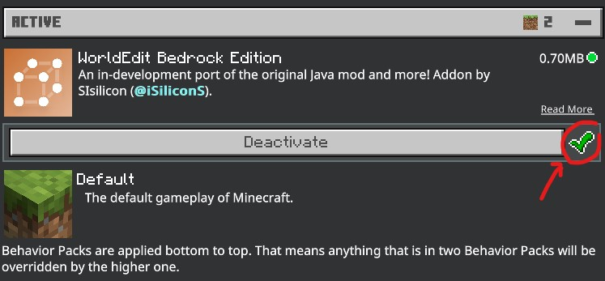
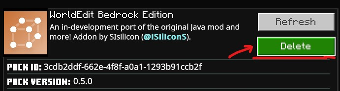

# Installation

[TOC]

## Requirements

WorldEdit: Bedrock Edition is an addon that's compatible with Minecraft 1.19 on Windows, Android, iOS and XBox. You can also install this addon on server hosting sites such as Aternos, allowing you to join worlds with this addon on any platform that Minecraft is available on. You can use this on both singleplayer and multiplayer games.

!!! note

    This addon **does not** run on Minecraft: Java Edition.

## Installation Step-by-Step

### Locally

Once you've downloaded the addon, simply open it with Minecraft to get it imported. Mobile users may need a file explorer that allows opening the addon with Minecraft. [CX File Explorer](https://play.google.com/store/apps/details?id=com.cxinventor.file.explorer) and [Documents](https://itunes.apple.com/app/id364901807) are recommended for Android and iOS respectively.

If you have the same, or later version of the addon already imported, you may need to delete both the behaviour and resource pack in `Settings > Storage`. In a new world, or an already existing one, add "WorldEdit" in `Behaviour Packs`. The resource pack should apply itself automatically. Also enable "Holiday Creator Features" and "Enable GameTest Framework" in `Experimental Features`. Create/Enter the world, and you're ready to use WorldEdit!

### Aternos Server

Firstly you must upload the addon in the server's `packs` folder. Then in a new or uploaded world, turn on the previously mentioned experimental toggles.

!!! warning

    You must not apply the addon to a world before uploading it to Aternos. Otherwise it will not work!

Read more about how aternos handles addons and experimental features [here](https://support.aternos.org/hc/en-us/articles/360042095232-Installing-Addons-Minecraft-Bedrock-Edition-) and [here](https://support.aternos.org/hc/en-us/articles/4407553257873-Enabling-experimental-gameplay-Minecraft-Bedrock-Edition-).

## Uninstalling from a world

Since this addon uses scripts, Minecraft won't allow you to just deactivate the behaviour pack. You need to delete it as shown.

