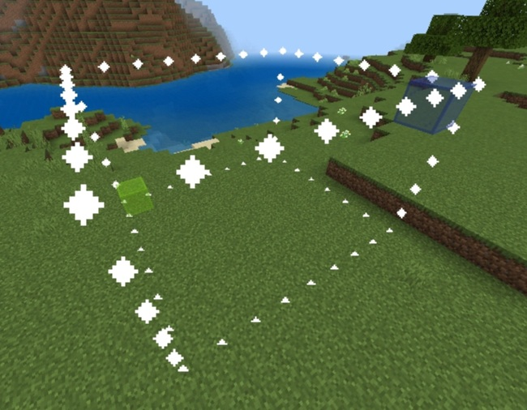
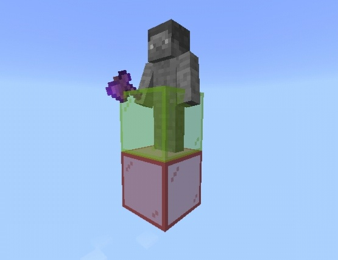

# Quick Start

## Before anything else...

By default, players are not allowed to use WorldEdit. Only those tagged as a builder can use its features. To make yourself a builder, enter `/tag @s add builder` in chat. You should then receive a message saying that you have been giving WorldEdit permissions.

!!! Tip

    You can also make other players builders by changing `@s` to the player's name. You'll need to surround it in quotes if it has a space in it. Eg: `/tag "Steve Wanderer" add builder`

## Going places

!!! Notice

    The commands provided by this addon use a semicolon (;) instead of a bracket (/).
    In the future, Mojang might add actual custom commands support to Minecraft.

Getting from point A to point B can sometimes be a hassle.
Luckily, this addon comes with what's known as a Navigation Wand.
To get one, you can either have a compass in your inventory, or enter the command `;navwand`.

Once you have this item, just interact with it to get teleported to the spot you are looking at.
Want to get on the otherside of a wall or ceiling? Use the wand while sneaking to go right through it!
Stuck in a block? Using the wand will get you unstuck!

!!! Tip

    If you don't want to use the navigation wand, these actions can also be done with the commands `;jumpto`, `;thru` and `;unstuck` as well.

## Making selections

Like the original mod, you use what's known as a selection wand to easily mark regions of your world for all sorts of operations.
To get one, grab a wooden axe, or enter the command `;wand`.

Selections in WorldEdit are cuboid shaped by default.
To make a selection, you need to mark the two corners of this cuboid.
You mark the first corner by using the wand on a block at that corner while sneaking.
You mark the second point by using it on a block _without_ sneaking. 
If done correctly, you should see a highlight of your selection.

If there's no block for you to mark a corner with, like high in the air, you can also use the commands `;pos1` or `;pos2` to mark the first and second corner respectively, as the position you are currently standing in. This is not the same as the position you are standing _on_.

## Kit items for convenience

There are many operations in WorldEdit that we may commonly use, such as undoing, and copying structures. To make this addon more convenient for mobile and controller players, it comes with a set of items that act as a shortcut to these common WorldEdit functions. To receive this kit, just type `;kit`.

## Doing stuff with your selection

Make a modest sized selection to work with, and have your kit ready.
We're going to try some of the features WorldEdit has to offer.

1. Place down stone, use the [Pattern Picker](usage/kit.md#pattern_picker) on it and use ["Selection Fill"](usage/kit.md#selection_fill). A cuboid of stone should be made.
2. Use the Pattern Picker on the air (mobile players must hold the screen with it) and use "Selection Fill" again to clear the stone.
3. Place down sandstone and glass, use the Pattern pPicker on the sandstone, and sneak and use it on the glass to add to your pattern. Use "Selection Fill" and you should have a mix of sandstone and glass.
4. Take out the Mask Picker in your inventory and use it on the sandstone. Set a block of your choice as your pattern, and use "Selection Fill". All sandstone should now be replaced with that block.
5. Repeat your selection upwards by typing the command `;stack 4 up`.

If you want to you can undo everthing by using the undo item until you can't undo any further.

## Playing with brushes

The kit also provides a way to make brushes.

1. Get a shovel of any type (preferably wooden).
2. Place down cobblestone; you'll need it for the brush.
3. Use the ["WorldEdit Settings"](usage/kit.md#config) item. A menu in your hotbar should appear including "Brush Settings". Select the item, then select the shovel to bind to. Make it a sphere brush of radius 3, and a cobblestone pattern. Confirm the settings and exit the menu.
4. Aim at the ground not near you and interact with the shovel (now brush) to place cobblestone spheres.
5. Make it so the brush only affects grass with `;mask tier grass`. `tier` is the kind of shovel you're binding the brush to. 1 is wooden, 2 is stone, and so on. Use the brush now to make a cobblestone path.
6. Disable the brush with `;br tier none`.

## What now?

You still have the rest of the docs you can look through. Go ahead and explore!
